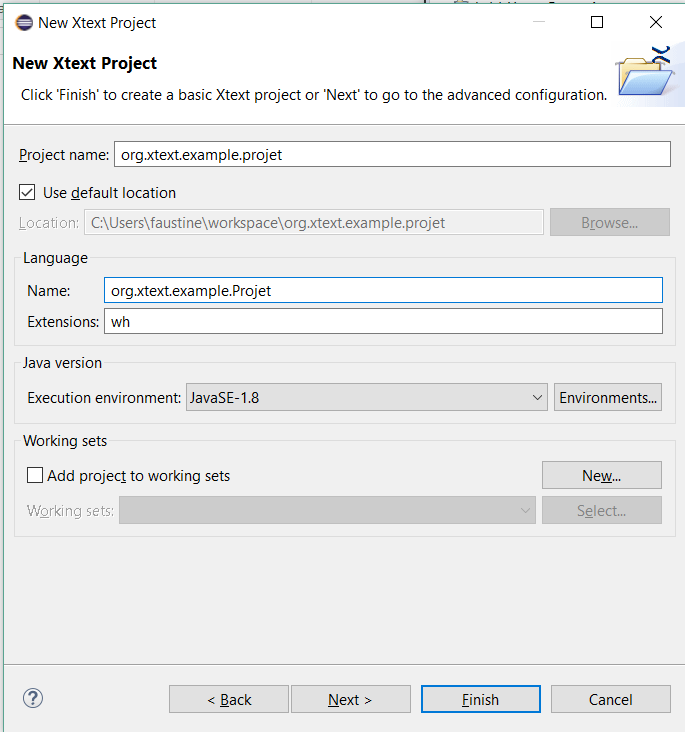

# COMP-JS

Ceci est le README du projet. Il faut y mettre toutes les infos concernant l'installation et l'utilisation du Compilateur.
Feel free to add more ;)

*********************** **COMMENT UTILISER GIT** ***********************

Pour ceux qui ont du mal avec GIT, tuto pour l'utiliser en **lignes de commandes**, je connais pas les interfaces et utilitaires. 

Pour télécharger le projet dans un premier temps : 

git clone https://github.com/AcidBaz/COMP-JS.git

cela va créér le dossier de projet.

Avant de faire des modifs, vérifiez que vous êtes à jour avec la branche principale, master avec : 

git status 

si vous ne l'êtes pas : 

git pull 

Une fois vos modifications terminées : 

git status 

pour voir les modifs.

Si vous avez créé des nouveaux fichiers il faut les ajouter avec :

git add "fichier"

Si vous en avez supprimé :

git rm "fichier"

Ensuite il faut commit vos changements avec un petit message explicatif :

git commit -m "votre message"

Enfin, il faut push sur le repertoire en ligne afin que tout le monde puisse accèder à vos modifs ( **NE JAMAIS PUSH SANS ETRE A JOUR** ) : 

git push 

Voila =) Ask Basile ou Antoine si besoin.

******** **Installation du projet Xtext sur Eclipse ** ******************

Pour installer le projet correctement :
Télécharger Eclipse et le plugin xtext.
Créer un nouveau projet xtext appelé "org.xtext.example.projet", avec comme extension ".wh"

Ensuite, il faut importer les fichiers donnés sur le github :  

GenerateProjet.mwe2 : dans org.xtext.example.projet -> src -> org.xtext.example   
Projet.xtext : dans org.xtext.example.projet -> src -> org.xtext.example  
Ensuite, faire "generate artifacts" sur Projet.xtext.   
Main.java : dans org.xtext.example.projet -> src -> org.xtext.example.generator  

Le fichier Projet.xtext contient la grammaire que l'on souhaite utiliser. Le fichier GenerateProject.mwe2 n'est pratiquement pas modifié : on ajotue les lignes "generator = {generateJavaMain = true}" afin d'avoir un fichier "Main.java".  
Ensuite, on modifie "Main.java" afin d'avoir un parser plus complet.  
Après avoir run le main une fois, on peut exporter le projet "org.xtext.example.projet" en .jar avec clic droit -> export -> Runnable JAR File  
  
Ce jar peut ensuite être utilisé comme parser :   
  

Sont également disponibles sur le repo le runnable JAR "projet.jar", et les deux fichiers "right.wh" et "wrong.wh" qui sont respectivement corrects et incorrects afin de pouvoir les tester.  
